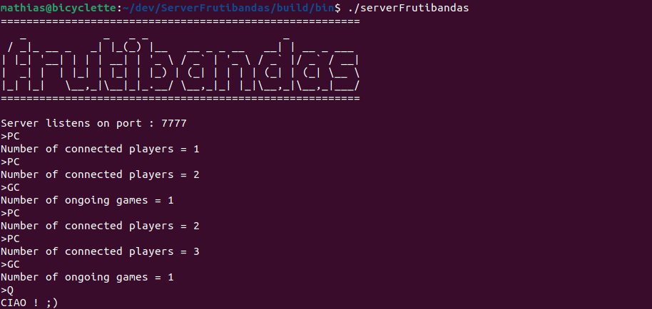

# ServerFrutibandas

<p align=center style="font-size:150%;">
C++ server for Frutibandas.<br><br>
</p>

<p align="center">

</p>

## Getting started

### Dependencies

- [Conan](https://conan.io/)
- [Cmake](https://cmake.org/)

## Build

```
conan install . -s build_type=Release --build missing --install-folder=build
cmake -B build -S .
cmake --build build
```

## Commands

- PC = print the number of players connected
- GC = print the number of ongoing games
- Q  = shtudown the server
